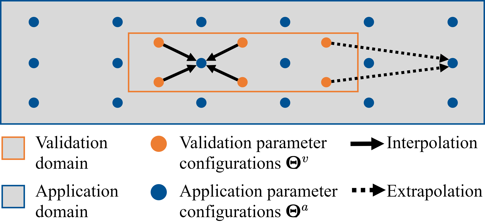
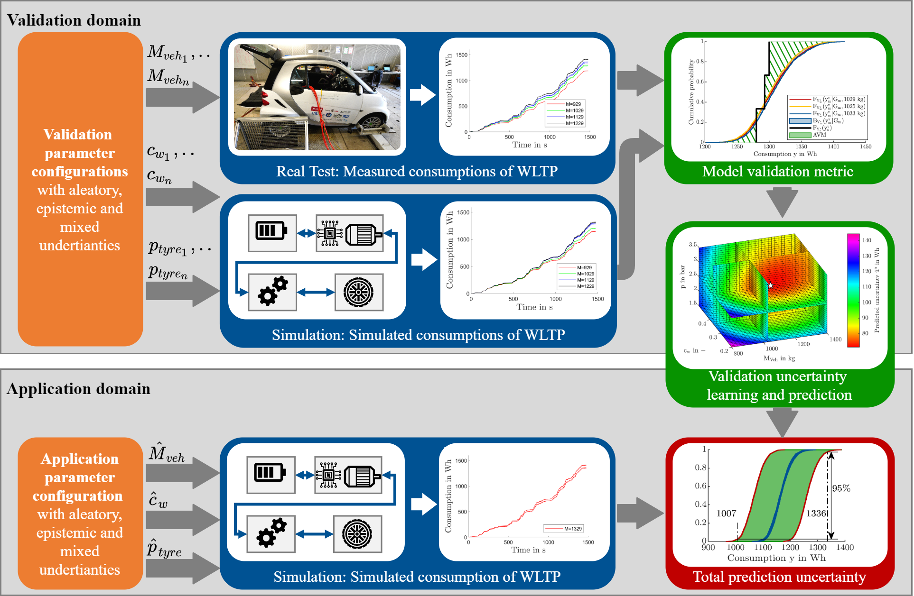
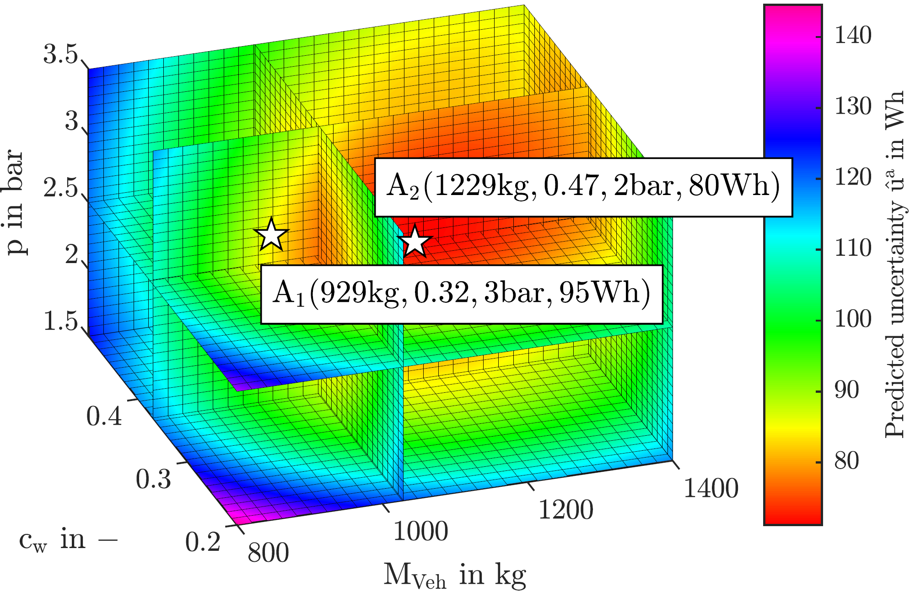

# Statistical Validation Framework for Automotive Vehicle Simulations using Uncertainty Learning
  
This framework enables statistical validation for automotive vehicle simulaitons in large application areas using uncertainty learning (VVUQ_Framework\@VVUQFramework_Main). With the  framework it is possible to flexibly validate every single simulation result of every individual application parameter configuration. It is focused on complex total vehicle simulations with a large number of changing parameters. The corresponding publicaiton for this framework is [1] and includes detailed information. The aim of this framework is to estimate the reliability of a model and each single simulation result depending on arbitrary parameter configurations of a large application domain. 

<div align="center">



<div align="left">
Therefore the model and result reliability of several validation parameter configurations must be estimated with multiple validation experiments forming the validation domain v. Based on the knowledge about the reliability from the validation domain the model and result reliability in the application domain can be predicted through inter- and extrapolation. The framework can be concluded as follows:


<div align="center">



<div align="left">
In this repository the model uncertainty of a smart for two estimating the consumption of the WLTC Class2 is calculated for ten parameter configurations using real measurements. The the air resistance, tyreparameters, and the mass of the vehicle are varied. they form the validaiton domain (VVUQ_Framework\@VVUQDomain_Main).


<div align="center">


<div align="left">
Based on those validaiton points, the model reliability of new application parameter configurations are predictet with multidimesnional linear regression and applying an additional prediction confidence intervall. We call this part uncertainty learning (VVUQ_Framework\@VUCLearning_Main).


<div align="center">
<center><p></p></center>

<div align="left">
For validation of the framework two example application parameter configurations are calculated once with the prediction intervall and once with additional validation measurements. Both model uncertainties can be compared (VVUQ_Framework\@VVUQDomain_Main, VVUQ_Framework\@VVUQSystem_Main). 


<div align="center">


<div align="left">
Finally all results of the validation and application domain are plotted. Additionally the trained linear regression model is plottet showing the model uncertainty of potential application parameter configurations depending on the three parameters mass, air resistance and tyre. This framework is modular so that the input measurement data, the model itself, and the uncertainty learning parameters can be adapted. 


  
## Getting Started

To get started the newest release of the repository needs to be downloaded including the submodules and the large  file storage (LFS) files. It needs to be mentioned that the LFS files are not included when downloading via the zip button on GitHub. They are included when cloning the repository or downloading a release. When opening in Matlab the repository must be added to the Matlab path. To start the a simulation, run the script "Run_VVUQ_Framework.m". The script opens the longitudinal simulation model SmartFortwo, parameterizes it, runs it and shows the results.

  
### Prerequisites
To run the code Matlab 2020b or newer is required. Matlab can be downloaded [here](https://de.mathworks.com/downloads/web_downloads/). Additionally the repository needs to be downloaded at [VVUQ-Framework](https://github.com/TUMFTM/VVUQ-Framework) 
  
### Installing
After the repository is downloaded at  [VVUQ-Framework](https://github.com/TUMFTM/VVUQ-Framework) it needs to be unpacked in a folder of choice. All Submodules and LFS files must be included. 
  

  
### Running the Model/Code

To run the code Matlab must be started. Browse to the folder where the repository was unpacked and add the folder to the Matlab Path. By running the script "Run_VVUQ_Framework.m" the simulation starts. To run the script, type following command in the command line:
  
```
>> Run_VVUQ_Framework
```
Because the running the Framework takes a long time some evaluation results are already stored in the folder "VVUQ_Framework\Results_VVUQ".
  
## Contributing and Support
  
For contributing to the code please contact [danquah@ftm.mw.tum.de](danquah@ftm.mw.tum.de).
  
## Versioning
R1.0 release in line with publication [1].
  
  
## Authors
Benedikt Danquah, Markus Lienkamp, Johannes Rühm, Marius Kirchgeorg, Yasin Meral, Akhmadjon Islambekov.

## Acknowledgement
The Authors want to thank research associates of the Institute of Automotive Engineering, who reviewed and gave advise for the component library.


  
## License
This project is licensed under the LGPL License - see the LICENSE.md file for details

## Sources


[[1]](https://www.mdpi.com/2076-3417/11/5/1983) [Benedikt Danquah](https://www.researchgate.net/profile/Benedikt_Danquah), Stefan Riedmaier, Yasin Meral, and Markus Lienkamp, “Statistical Validation Framework for Automotive Vehicle Simulations Using Uncertainty Learning”, Applied Sciences, Volume 11, Issue 5, 2021.

[[2]](https://www.doi.org/10.1109/EVER.2019.8813568) [Benedikt Danquah](https://www.researchgate.net/profile/Benedikt_Danquah), Alexander Koch, Tony Weiß, Markus Lienkamp, Modular, Open Source Simulation Approach: Application to Design and Analyze Electric Vehicles, In 2019 Fourteenth International Conference on Ecological Vehicles and Renewable Energies (EVER), Monaco, 2019.

 


